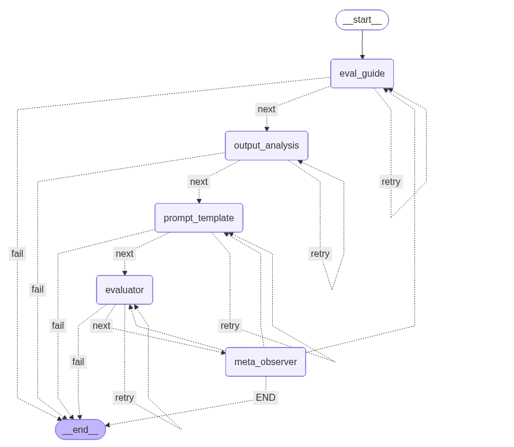

# EU AI Act Compliance Benchmarking Framework

An automated system for evaluating Large Language Model (LLM) candidates against EU AI Act compliance requirements using dynamic benchmark generation and multi-agent evaluation pipelines.

## Overview

This framework helps organizations deploying AI systems in high-risk domains (like education, healthcare, or finance) to:

1. **Assess EU AI Act compliance obligations** for their specific use case
2. **Evaluate LLM provider eligibility** based on transparency, governance, and regulatory alignment
3. **Automatically generate task-specific benchmarks** from public datasets
4. **Run comprehensive evaluations** across multiple models using both deterministic metrics and LLM-as-a-judge approaches
5. **Validate evaluation pipelines** through meta-observation to ensure reliability

### Example Use Case

The included example evaluates AI models for **Diotima** - an AI-powered teaching assistant that helps educators create assessments and grade student work. As a high-risk AI system under EU AI Act Annex III (Education), it requires strict compliance with data governance, transparency, human oversight, and accuracy requirements.

## Workflow

### 1. Compliance Analysis
```
Project Description → LLM Analysis → EU AI Act Risk Classification & Requirements
```
- Determines risk category (prohibited/high-risk/limited/minimal)
- Identifies applicable compliance obligations (data quality, transparency, human oversight, etc.)

### 2. Model Selection & Eligibility Assessment
```
Top Models → Web Search for Documentation → Compliance Gap Analysis → Advisability Rating
```
- Scrapes leading models from LMArena leaderboard
- Searches for model cards, safety reports, and governance documentation
- Rates each model as `low`/`medium`/`high` advisability based on:
  - Technical documentation transparency
  - Data governance disclosures
  - EU regulatory commitments
  - Known limitations vs. compliance requirements

### 3. Benchmark Discovery & Validation
```
Compliance Requirements → Web Search → Relevant Datasets → Safety & Size Validation
```
- Identifies public benchmarks (e.g., MMLU, GSM8K, TruthfulQA)
- Validates Hugging Face datasets for:
  - Code safety (scans for malicious remote execution)
  - Reasonable size (<5GB)
  - Proper loading configurations

### 4. Automatic Evaluation Pipeline Generation

For each benchmark, a **LangGraph-based multi-agent system** creates a complete evaluation pipeline:



**Each node includes retry logic with error feedback:**

- **Eval Guide**: Analyzes dataset structure, determines evaluation methodology (reference-based vs reference-free, deterministic vs LLM-judge)
- **Output Analysis**: Optionally computes dataset statistics to guide evaluation (e.g., expected answer length distributions)
- **Prompt Template**: Generates Jinja2 templates that instruct models to produce evaluable outputs
- **Evaluator**: Implements either:
  - **Deterministic metrics** (Accuracy, F1, Exact Match) via auto-generated Python code
  - **LLM-as-a-judge** with rubric-based scoring prompts
- **Meta-Observer**: Validates the entire pipeline by reviewing sample predictions and scores, identifying systemic flaws

### 5. Multi-Model Evaluation & Ranking
```
Models × Benchmarks → Parallel Evaluation → Aggregated Scores → Ranked Leaderboard
```
- Runs each model on N samples per benchmark
- Computes per-task and overall win rates
- Generates detailed logs with predictions and scores

## Installation

```bash
# Clone repository
git clone https://github.com/mailong25/benchmarking-agent

# Install dependencies
pip install -r requirements.txt
```

### Running Full Pipeline

```
Please use Main.ipynb for step-by-step running instruction
```

This will:
1. Analyze your project against EU AI Act requirements
2. Fetch top models from LMArena
3. Assess model eligibility with web search
4. Discover and validate benchmarks
5. Generate evaluation pipelines with retry logic
6. Run evaluations across all model-benchmark combinations
7. Output ranked results table

## Example output

### Compliance Report
```
Risk Category: High-Risk (Annex III, Education)
Key Obligations:
- Risk Management System
- Data Governance (representative, bias-free training data)
- Technical Documentation
- Transparency & Human Oversight
- Conformity Assessment & CE Marking
```

### Model Eligibility Assessment
```
Model: gemini-3-flash
Advisability: medium
Reasoning: Strong technical capabilities but closed training data limits 
           Data Governance verification for high-risk use cases.
Sources: [model card URLs, safety reports, documentation]
```

### Evaluation Results Table
```
Model                              Mean win rate  MMLU   GSM8K  TruthfulQA
gemini/gemini-3-pro-preview        0.847          0.891  0.823  0.829
openai/gpt-4.1                     0.824          0.865  0.801  0.806
gemini/gemini-3-flash-preview      0.779          0.812  0.768  0.757
```

## Key Features

### 🔒 Safety-First Design
- **Code safety scanning**: Validates HuggingFace dataset loading scripts for malicious code
- **Dataset size limits**: Prevents resource exhaustion
- **Retry logic**: Gracefully handles LLM generation failures with error feedback

### 🤖 Intelligent Evaluation
- **Adaptive methodology**: Automatically chooses between deterministic metrics and LLM-as-judge based on task characteristics
- **Meta-validation**: Self-corrects evaluation pipelines through meta-observation
- **Reference-aware**: Distinguishes between reference-based and reference-free evaluation needs

### 📊 Compliance-Driven
- **EU AI Act focus**: Built specifically for high-risk AI system assessment
- **Transparency requirements**: Prioritizes models with strong documentation
- **Human oversight**: Evaluates model suitability for human-in-the-loop workflows


## Project Structure

```
├── prompts.yml             # LLM prompt templates
├── schemas.py              # Pydantic models for structured outputs
├── llm_utils.py            # LLM interaction utilities
├── utils.py                # Helper functions (code compilation, sampling)
├── Main.ipynb              # Notebook containing step-by-step execution
└── README.md
```

## License

MIT License
